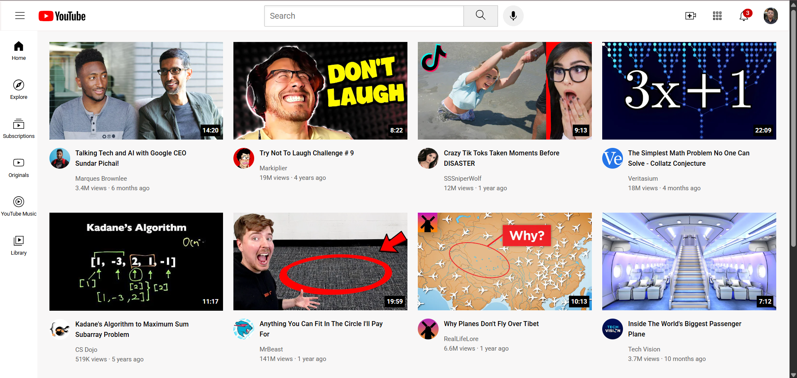

📺 YouTube Homepage Clone

A visually faithful and responsive clone of the YouTube homepage, built from scratch using pure HTML5 and CSS3. This project demonstrates a strong understanding of modern front-end layout techniques, including CSS Flexbox for flexible alignment and CSS Grid for complex, responsive galleries.

🔴 Live Demo: https://youtube-clone-yash-singhal.netlify.app/

✨ Features
Responsive Header: A fully functional header with a three-column layout that adapts to different screen sizes. Includes a search bar and interactive icon tooltips on hover.

Dynamic Video Grid: A fluid grid of video previews created with CSS Grid. The number of columns adjusts automatically based on the viewport width (from 2 columns on mobile to 4 on wide desktops).

Fixed Sidebar: A vertical navigation sidebar that remains fixed on the left, providing a familiar user experience.

Pixel-Perfect Details: Includes details like video duration overlays, channel profile pictures, and notification counters to closely match the original YouTube design.

Hover Effects: Smooth, subtle hover effects on buttons, links, and icons to enhance interactivity.

🛠️ Technologies Used
This project was built using core front-end technologies, with a strong focus on clean, semantic HTML and advanced CSS for layout and styling.

HTML5: For structuring the content.

CSS3: For all styling, layout, and responsiveness.

Flexbox: Used for arranging items in the header and sidebar.

Grid: Used for the main video gallery layout.

Media Queries: For creating a seamless experience across mobile, tablet, and desktop screens.
